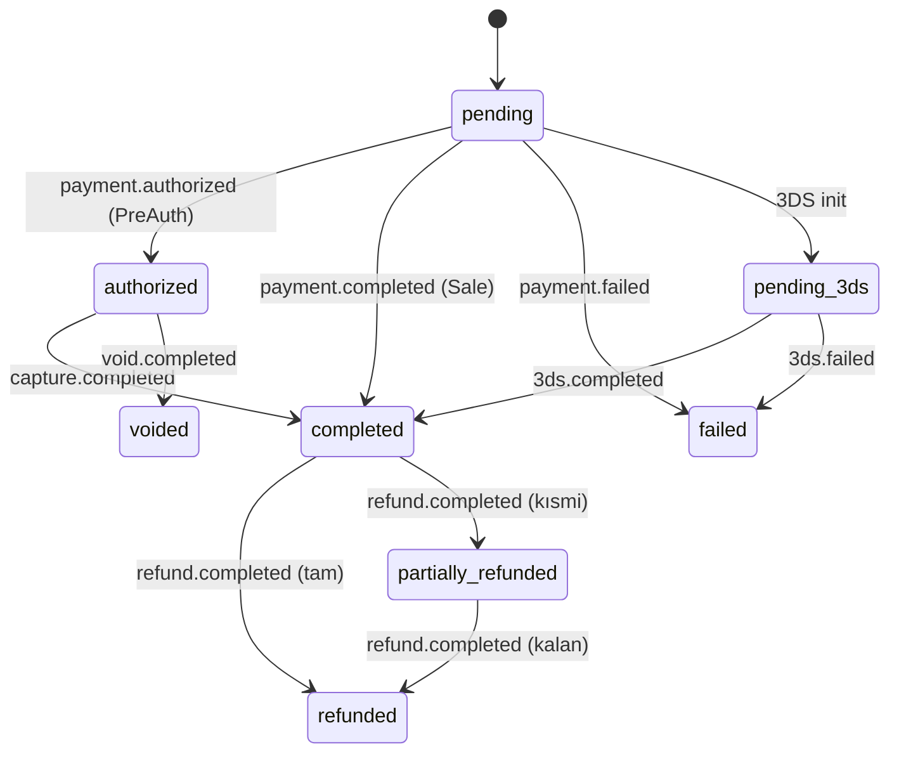

Sanal POS şu anda **8 olay tipi** yayınlar. Subscription oluştururken `events[]` dizisinde dinlemek istediklerinizi belirtirsiniz.

## Genel zarf

Tüm olaylar şu zarfta gönderilir:

```json
{
  "id":         "evt_8e3f5c129a7b4c8dbc4e",
  "type":       "payment.completed",
  "created_at": "2026-05-03T12:34:58.123+00:00",
  "data": { /* olaya özel payload — aşağıda */ }
}
```

| Alan | Açıklama |
|---|---|
| `id` | Olay kimliği — idempotency için kullanın. **Aynı olay birden fazla kez gönderilebilir** ama `id` aynıdır. |
| `type` | Olay tipi (`payment.completed`, `refund.completed`, vb.) |
| `created_at` | Olayın Payven tarafında oluşturulma zamanı (UTC, ISO 8601) |
| `data` | Olaya özel payload — bkz. her olay altında |

## `data` ortak alanları

Tüm `data` payload'ları aşağıdaki alanları içerir (boş olabilirler):

| Alan | Açıklama |
|---|---|
| `transaction_id` | İlgili işlemin Payven kimliği (UUID) |
| `status` | İşlem mevcut durumu — bkz. [Payment Status](/sanal-pos/payment-object#status-degerleri) |
| `amount` | Tutar (kuruş) |
| `currency` | Para birimi |
| `merchant_id` | İşlemin merchant kimliği |
| `provider_transaction_id` | Bankadaki referans |
| `auth_code` | Onay kodu |
| `error_code` | Hata kodu (sadece başarısız olaylarda dolu) |
| `error_message` | Hata mesajı |
| `masked_card_number` | Maskelenmiş kart (örn. `454671******7894`) |
| `card_brand` | Kart birliği (`visa`, `mastercard`, `troy`, `amex`) |

## Olay tipleri

### `payment.completed`

**Tetikleyici:** Sale akışı (Non-3D veya 3DS sonrası) başarıyla tamamlandığında.

```json
{
  "id":         "evt_...",
  "type":       "payment.completed",
  "created_at": "2026-05-03T12:34:58.123+00:00",
  "data": {
    "transaction_id":          "8e3f5c12-...",
    "status":                  "completed",
    "amount":                  15000,
    "currency":                "TRY",
    "merchant_id":             "3fa85f64-...",
    "provider_transaction_id": "9f3d2b8e-...",
    "auth_code":               "123456",
    "error_code":              null,
    "error_message":           null,
    "masked_card_number":      "454671******7894",
    "card_brand":              "visa"
  }
}
```

### `payment.failed`

**Tetikleyici:** Banka tarafı reddi veya teknik hata.

```json
{
  "id":         "evt_...",
  "type":       "payment.failed",
  "created_at": "2026-05-03T12:34:58.123+00:00",
  "data": {
    "transaction_id":     "8e3f5c12-...",
    "status":             "failed",
    "amount":             15000,
    "currency":           "TRY",
    "merchant_id":        "3fa85f64-...",
    "auth_code":          null,
    "error_code":         "bank_declined",
    "error_message":      "Yetersiz bakiye",
    "masked_card_number": "454671******7894",
    "card_brand":         "visa"
  }
}
```

### `payment.authorized`

**Tetikleyici:** Pre-Auth (ön provizyon) başarıyla alındığında. Tutar bloke edildi, henüz çekilmedi.

```json
{
  "type": "payment.authorized",
  "data": {
    "transaction_id": "8e3f5c12-...",
    "status":         "authorized",
    "amount":         50000,
    "currency":       "TRY",
    "auth_code":      "123456"
  }
}
```

### `capture.completed`

**Tetikleyici:** Pre-Auth → Capture başarıyla tamamlandığında.

```json
{
  "type": "capture.completed",
  "data": {
    "transaction_id": "8e3f5c12-...",
    "status":         "completed",
    "amount":         47500,
    "currency":       "TRY",
    "auth_code":      "789012"
  }
}
```

### `void.completed`

**Tetikleyici:** İşlem void edildiğinde (mutabakat öncesi tam iptal).

```json
{
  "type": "void.completed",
  "data": {
    "transaction_id":          "8e3f5c12-...",
    "status":                  "voided",
    "provider_transaction_id": "VOID-9f3d2b8e"
  }
}
```

### `refund.completed`

**Tetikleyici:** İade başarıyla yapıldığında (tam veya kısmi).

```json
{
  "type": "refund.completed",
  "data": {
    "transaction_id":          "8e3f5c12-...",
    "status":                  "partially_refunded",
    "amount":                  5000,
    "currency":                "TRY",
    "provider_transaction_id": "REFUND-9f3d2b8e"
  }
}
```

`status` alanı işlemin **yeni** durumunu yansıtır: kısmi iade ise `partially_refunded`, tüm tutar iade edildiyse `refunded`.

### `3ds.completed`

**Tetikleyici:** 3D Secure doğrulaması başarılı + bankada otorizasyon başarılı.

```json
{
  "type": "3ds.completed",
  "data": {
    "transaction_id": "8e3f5c12-...",
    "status":         "completed",
    "amount":         15000,
    "currency":       "TRY",
    "auth_code":      "123456"
  }
}
```

### `3ds.failed`

**Tetikleyici:** 3DS doğrulaması başarısız (yanlış SMS, timeout, kullanıcı iptali) veya 3DS sonrası banka reddi.

```json
{
  "type": "3ds.failed",
  "data": {
    "transaction_id": "8e3f5c12-...",
    "status":         "failed",
    "error_code":     "three_ds_authentication_failed",
    "error_message":  "3D Secure doğrulaması başarısız."
  }
}
```

## Olay → İşlem durumu eşleşmesi



## Webhook subscription örneği

```bash
curl -X POST https://vpos.payven.com.tr/api/v1/webhooks \
  -H "Authorization: Bearer $PAYVEN_TOKEN" \
  -H "Content-Type: application/json" \
  -d '{
    "url":    "https://example.com/webhooks/payven",
    "events": [
      "payment.completed",
      "payment.failed",
      "payment.authorized",
      "capture.completed",
      "void.completed",
      "refund.completed",
      "3ds.completed",
      "3ds.failed"
    ]
  }'
```

Tüm olaylara abone olmak için `["*"]` kullanmayın — açık liste tutmak ileride yeni olay tiplerini bilinçli almanızı sağlar (mevcut handler'ınızda olmayan olay tipleri unhandled error fırlatmasın).

## Yol haritası

İleride eklenmesi planlanan olaylar:

- `chargeback.received` — bankadan chargeback bildirimi
- `chargeback.resolved` — chargeback sonuçlandı
- `settlement.created` — günlük mutabakat raporu hazır
- `connector.health_changed` — banka sağlık durumu değişti

Güncellemeler için [Changelog](/resources/changelog) sayfasını izleyin.
