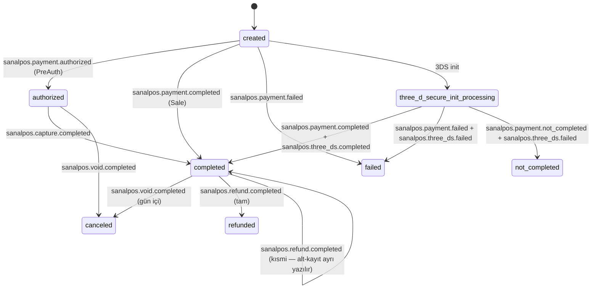

Sanal POS şu anda **36 olay tipi** yayınlar: işlem yaşam döngüsü (11) + recurring/subscription (6) +
itiraz/chargeback (2) + marketplace sub-merchant (3) + marketplace split (7) + settlement (6) +
parçalı hakediş (1). Webhook ucunu oluştururken `enabled_events` dizisinde dinlemek istediklerinizi
belirtirsiniz. Güncel liste (Türkçe ad ve açıklamayla) `GET /api/v1/webhook-endpoints/event-types`
ucundan (İşyeri API'si) alınır; tüm ürünlerin kodları: [Webhook Olay Referansı](/documentation/concepts/webhook-events).

## Genel yapı

Olay tipi ve teslimat metadata'sı **HTTP header'larında** da taşınır:

| Header | Açıklama |
|---|---|
| `X-Payven-Event` | Olay tipi (`sanalpos.payment.completed`, `sanalpos.refund.completed`, ...) |
| `X-Payven-Event-Id` | Olay kimliği (`evt_...`) — idempotency için kullanın. **Aynı olay birden fazla kez gönderilebilir** ama event id aynıdır. |
| `X-Payven-Delivery-Id` | Teslim kimliği |
| `X-Payven-Signature` | `sha256=<hex>` HMAC imzası — bkz. [İmza Doğrulama](/sanal-pos/webhooks/signature) |
| `X-Payven-Timestamp` | İmza zaman damgası (Unix saniye) |

Gövde varsayılan olarak **olay zarfıdır** — `{id, object: "event", type, created, livemode, api_version, resource_id, data: {object}}` — ve aşağıdaki tablolarda anlatılan alanlar
**`data.object`** altındadır. Uç `payload_format: flat` ile açıldıysa gövde yalnız bu nesnedir
(zarfsız). Zarf ayrıntısı: [Webhook'lar](/documentation/concepts/webhooks).

`data.object.event_type` alanı zarftaki `type` ve `X-Payven-Event` ile aynıdır.

## İşlem (transaction) olayları — ortak payload

`sanalpos.payment.*`, `sanalpos.refund.*`, `sanalpos.void.*`, `sanalpos.capture.completed`, `sanalpos.three_ds.*` olaylarının
tümü aynı gövde şemasını kullanır:

| Alan | Açıklama |
|---|---|
| `event_type` | Olay tipi |
| `webhook_event_id` | Üreticinin olay kimliği (UUID) — tekilleştirmede zarftaki `id` / `X-Payven-Event-Id` tercih edin |
| `transaction_id` | İlgili işlemin Payven kimliği (UUID) |
| `tenant_id` | Tenant kimliği |
| `status` | İşlem mevcut durumu (snake_case) — bkz. [Payment Status](/sanal-pos/payment-object#status-degerleri) |
| `operation_type` | İşlem tipi (`sale`, `pre_auth`, `recurring`, ...) |
| `amount` | Tutar (kuruş) — vade farkı dahil brüt müşteri tutarı |
| `currency` | Para birimi |
| `merchant_id` | İşlemin merchant dış kimliği (string) |
| `external_id` | Sizin sipariş referansınız (init isteğindeki `external_id`) |
| `basket_id` | Sepet/fatura referansınız |
| `provider_transaction_id` | Bankadaki referans |
| `auth_code` | Onay kodu |
| `host_reference` | Banka RRN/host referansı — mutabakat eşlemesi için kritik |
| `error_code` / `error_message` | Hata kodu/mesajı (yalnız başarısız olaylarda dolu) |
| `masked_card_number` | Maskelenmiş kart (örn. `454671******7894`) |
| `card_brand` | Kart programı (snake_case; örn. `bonus`, `world`, `axess` — scheme değil) |
| `connector_config_id` / `bank_code` | İşlemin geçtiği banka konfigürasyonu |
| `payment_method_category` / `payment_method_code` / `payment_method_reference` | APM bilgisi (Apple Pay/Google Pay vb.; kart için `card`) |
| `refund_id` | **İadenin kendi kimliği** (UUID) — yalnız `sanalpos.refund.completed` / `sanalpos.refund.failed`'da dolu. `GET /api/v1/refunds` listesindeki `id` ve iade yanıtındaki `extra_properties.refund_id` ile birebir aynı değer |
| `provider_refund_id` | **İadenin banka referansı** — `provider_transaction_id`'den ayrı değer (o ödemenindir). Banka ekstresi eşlemesi için. Banka referans dönmediyse veya `sanalpos.refund.failed`'da `null` |
| `refund_amount` / `remaining_amount` | Yalnız `sanalpos.refund.completed`'da dolu — bu operasyonda iade edilen tutar ve kalan net tutar (kuruş) |
| `installment_count` / `installment_amount` / `interest_rate` / `interest_amount` / `installment_interest_mode` / `bank_additional_install_count` / `bank_defering_month` | Taksit/vade farkı snapshot'ı (`sanalpos.payment.completed`/`authorized`'da dolar) |
| `occurred_at` | Olayın gerçekleşme zamanı (+03:00 Türkiye saati) |
| `metadata` | Serbest metadata sözlüğü (örn. `payment_link_id`, `checkout_session_id` + ödeme linki form alanları) |

### `sanalpos.payment.completed`

**Tetikleyici:** Sale akışı (Non-3D veya 3DS sonrası) başarıyla tamamlandığında.

```json
{
  "event_type":              "sanalpos.payment.completed",
  "webhook_event_id":        "9f1c8e76-2a3b-4f12-9c8d-12cb24a8a8a8",
  "transaction_id":          "8e3f5c12-9a7b-4c8d-bc4e-2c963f66afa6",
  "tenant_id":               "11111111-1111-1111-1111-111111111111",
  "status":                  "completed",
  "operation_type":          "sale",
  "amount":                  15000,
  "currency":                "TRY",
  "merchant_id":             "MRCH-001",
  "external_id":             "ORDER-1001",
  "basket_id":               "BASKET-2026-001",
  "provider_transaction_id": "9f3d2b8e-...",
  "auth_code":               "123456",
  "host_reference":          "PAYVEN-REF-789",
  "error_code":              null,
  "error_message":           null,
  "masked_card_number":      "454671******7894",
  "card_brand":              "bonus",
  "connector_config_id":     "5b2e7c10-...",
  "bank_code":               "akbank",
  "payment_method_category": "card",
  "installment_count":       1,
  "occurred_at":             "2026-05-03T15:34:58.123+03:00"
}
```

### `sanalpos.payment.failed`

**Tetikleyici:** Banka tarafı reddi veya teknik hata (Non-3D veya 3DS akışı). `error_code`
Payven hata kodunu taşır — bkz. [Payven Hata Kodları](/sanal-pos/errors/payven-codes).

### `sanalpos.payment.not_completed`

**Tetikleyici:** İşlem **tamamlanmadı** — müşteri 3D Secure doğrulamasını bitirmeden ayrıldı ya da
oturum zaman aşımına uğradı; istek bankaya hiç ulaşmadan (ön kontrol) sonuçlanan işlemler de bu
olayla biter. Bu bir **banka reddi değildir** ve para hareketi yoktur; `status: "not_completed"`.
`sanalpos.payment.failed`'dan ayrı bir koddur — terk edilen işlemi gerçek decline'dan ayırt edip
filtreleyebilirsiniz. 3D işlemlerde ayrıca `sanalpos.three_ds.failed` yayınlanır.

<Tip>
Siparişi "ödeme bekleniyor" durumundan çıkarmak için bu olaya da abone olun; aksi halde terk
edilen sipariş süresiz askıda kalır. Müşteri aynı siparişi yeniden deneyebilir.
</Tip>

### `sanalpos.payment.authorized`

**Tetikleyici:** Pre-Auth (ön provizyon) başarıyla alındığında. Tutar bloke edildi, henüz çekilmedi. `status: "authorized"`.

### `sanalpos.capture.completed`

**Tetikleyici:** Pre-Auth → Capture başarıyla tamamlandığında.

### `sanalpos.void.completed`

**Tetikleyici:** İşlem void edildiğinde (mutabakat öncesi tam iptal). Pre-Auth iptalinde de bu olay yayınlanır. `status: "canceled"`.

### `sanalpos.void.failed`

**Tetikleyici:** İptal (void) denemesi banka tarafından reddedildiğinde veya teknik hata aldığında.
Para hareketi yoktur; işlem iptal öncesi durumuna geri döner. `error_code` / `error_message`
sebebi taşır. Gün sonu geçtiyse iptal yerine [iade](/sanal-pos/payments/refund) yapın.

### `sanalpos.refund.completed`

**Tetikleyici:** İade başarıyla yapıldığında (tam veya kısmi). `refund_amount` bu operasyonda iade
edilen tutarı, `remaining_amount` kalan net tutarı taşır — `refund_amount < amount` ise kısmi
iadedir. Kısmi iadede ana Transaction `completed` kalır; tam iadede `refunded` olur.

```json
{
  "event_type":              "sanalpos.refund.completed",
  "webhook_event_id":        "c4b6f1a2-8d33-4a51-9f7e-3d2b6a19c405",
  "transaction_id":          "216a8817-d8d5-485a-b380-0fd300e03741",
  "refund_id":               "e733dabf-91f3-44a1-9684-bfc958543b0d",
  "provider_refund_id":      "TEST-R-ae527339f82441efa",
  "status":                  "completed",
  "amount":                  500,
  "refund_amount":           100,
  "remaining_amount":        400,
  "currency":                "TRY",
  "external_id":             "ORDER-1001",
  "provider_transaction_id": "TEST-c7f83252078f425ea69",
  "occurred_at":             "2026-09-04T11:20:03.412+03:00"
}
```

<Warning>
İadeyi **`refund_id`** ile eşleştirin. `transaction_id`, `provider_transaction_id` ve
`external_id` **ödemeye** aittir ve aynı ödemenin tüm iadelerinde aynı değeri taşır — aynı ödeme
üzerinde eş zamanlı iki iade açıksa (örneğin API'den başlattığınız bekleyen iade + panelden
yapılan ikinci iade) bu alanlarla eşleştirme yanlış kaydı kapatır. `refund_id`,
`GET /api/v1/refunds` listesindeki `id` ve iade yanıtındaki `extra_properties.refund_id` ile
birebir aynıdır.
</Warning>

İki banka referansını karıştırmayın: `provider_transaction_id` **ödemenin**,
`provider_refund_id` **iadenin** banka referansıdır. Yukarıdaki örnekte ödeme
`TEST-c7f83252078f425ea69`, iade `TEST-R-ae527339f82441efa` taşır.

### `sanalpos.refund.failed`

**Tetikleyici:** İade denemesi banka tarafından reddedildiğinde veya teknik hata aldığında. Para
hareketi yoktur; ana Transaction iade öncesi durumuna geri döner. `error_code` / `error_message`
sebebi taşır, `refund_id` ise başarısız denemenin audit kaydının kimliğidir — bekleyen iade
kaydınızı bu kimlikle kapatabilirsiniz. `provider_refund_id` bu olayda `null`'dır (banka iade
referansı üretmedi).

### `sanalpos.three_ds.completed` / `sanalpos.three_ds.failed`

**Tetikleyici:** 3D Secure akışının terminal sonucu.

<Note>
3D akışında terminal webhook **her zaman** `sanalpos.payment.completed`/`sanalpos.payment.authorized`/`sanalpos.payment.failed`
olarak gider; `sanalpos.three_ds.completed`/`sanalpos.three_ds.failed` bunlara **ek** yayınlanır. Sipariş durumunu
`sanalpos.payment.*` olaylarından yönetin; `sanalpos.three_ds.*` olaylarını 3DS-spesifik takip için kullanın.
</Note>

## Recurring (subscription) olayları

Payload şeması işlem olaylarından farklıdır:

| Alan | Açıklama |
|---|---|
| `event_type` | Olay tipi |
| `plan_id` | Tekrarlayan plan kimliği (UUID) |
| `tenant_id` / `merchant_id` / `external_id` | Kimlikler |
| `plan_status` | Planın mevcut durumu |
| `installment_index` / `installment_status` | İlgili taksit ve durumu |
| `amount` / `currency` | Taksit tutarı (kuruş) |
| `provider_recurring_id` / `provider_process_id` | Banka tarafı referanslar |
| `result_code` / `result_message` | Banka sonucu |
| `masked_card_number` | Maskelenmiş kart |
| `occurred_at` | Olay zamanı (+03:00) |

| Olay | Tetikleyici |
|---|---|
| `sanalpos.subscription.charged` | Bir taksit başarıyla çekildi — ilişkili Transaction için ayrıca `sanalpos.payment.completed` yayınlanır |
| `sanalpos.subscription.failed` | Bir taksit başarısız oldu (plan otomatik askıya alınmaz) |
| `sanalpos.subscription.cancelled` | Plan iptal edildi |
| `sanalpos.subscription.completed` | Planın tüm taksitleri tamamlandı |
| `sanalpos.subscription_charge.reversed` | Önceden çekilmiş taksit provider tarafında tersine çevrildi (same-day void/reversal) — ilişkili Transaction için ayrıca `sanalpos.void.completed` yayınlanır |
| `sanalpos.subscription_charge.failed` | Önceden çekilmiş taksiti provider sonradan Error olarak raporladı — ilişkili Transaction için ayrıca `sanalpos.payment.failed` yayınlanır |

<Note>
**Taksit işlemlerinin `external_id`'si taksit-bazında benzersizdir.** Bir taksitin ilişkili
işlem (Transaction) olayında (`sanalpos.payment.completed` / `sanalpos.payment.failed`) `external_id`, planın
`external_id`'sine taksit sırası eklenerek üretilir: **`{plan_external_id}-{installment_index}`**
(örn. plan `SUB-1001` → 2. taksit `SUB-1001-2`). Böylece her taksiti `external_id` ile ayrı ayrı
eşleştirebilirsiniz. `sanalpos.subscription.*` olaylarındaki `external_id` ise **planın kendi** değeridir
(sıra eki olmadan); taksiti `installment_index` alanından ayırt edin.
</Note>

## İtiraz (chargeback) olayları

| Olay | Tetikleyici |
|---|---|
| `sanalpos.chargeback.opened` | Kart sahibi işleme itiraz etti (ters ibraz açıldı) |
| `sanalpos.chargeback.resolved` | İtiraz sonuçlandı (`status` sonucu taşır) |

Payload: `event_type`, `webhook_event_id`, `chargeback_id`, `transaction_id`, `tenant_id`,
`merchant_id`, `amount`, `currency`, `status`, `reason`, `reason_code`, `external_id`,
`bank_reference_no`, `response_deadline`, `occurred_at`. Ayrıntı: [Ters İbraz](/sanal-pos/reporting/chargebacks).

## Marketplace olayları

### Sub-merchant lifecycle

Payload: `event_type`, `tenant_id`, `sub_merchant_id`, `sub_merchant_external_id`, `name`,
`parent_merchant_id`, `marketplace_role`, `payout_iban`, `is_active`, `occurred_at`.

| Olay | Tetikleyici |
|---|---|
| `sanalpos.submerchant.created` | Yeni alt-bayi oluşturuldu |
| `sanalpos.submerchant.updated` | Alt-bayi güncellendi |
| `sanalpos.submerchant.deactivated` | Alt-bayi pasifleştirildi |

### Split (escrow) lifecycle

Payload: `event_type`, `split_id`, `transaction_id`, `tenant_id`, `parent_merchant_id`,
`sub_merchant_id`, `amount`, `parent_commission`, `net_amount`, `currency`,
`approval_status`, `auto_release_at`, `occurred_at`.

| Olay | Tetikleyici |
|---|---|
| `sanalpos.payment_split.created` | İşlem split kaydı oluşturuldu |
| `sanalpos.payment_split.approved` | Split onaylandı |
| `sanalpos.payment_split.held` | Split bekletmeye alındı |
| `sanalpos.payment_split.released` | Split serbest bırakıldı (payout edilebilir) |
| `sanalpos.payment_split.refunded` | Split tam iade edildi |
| `sanalpos.payment_split.partially_refunded` | Split kısmi iade edildi |
| `sanalpos.payment_split.auto_release_scheduled` | Otomatik serbest bırakma planlandı |

## Settlement olayları

Settlement olayları **feature-prefix'li** isimlendirilir (`sanalpos.settlement.*`):

| Olay | Tetikleyici |
|---|---|
| `sanalpos.settlement.created` | Gün/dönem settlement kaydı oluşturuldu |
| `sanalpos.settlement.updated` | Rezerve — event-types listesinde yer alır, şu an yayınlanmaz (dönem sonrası düzeltmeler [devreden kalem](/sanal-pos/reporting/settlements#devreden-kalemler-carry-forward) modeliyle yeni satıra yansır) |
| `sanalpos.settlement.processing` | Settlement işleme alındı |
| `sanalpos.settlement.completed` | Settlement tamamlandı |
| `sanalpos.settlement.failed` | Settlement başarısız |
| `sanalpos.settlement.cancelled` | Settlement iptal edildi |

Payload: `event_type`, `settlement_id`, `tenant_id`, `merchant_id`, `source_feature`,
`source_code`, `currency`, `gross_amount`, `refund_amount`, `bank_commission`,
`platform_commission`, `parent_commission_paid`, `net_amount`,
`marketplace_commission_income`, `sub_payout_obligations`, `real_net_earning`,
`transaction_count`, `refund_count`, `period_start`, `period_end`, `status`,
`bank_reference`, `occurred_at`. Alan anlamları için bkz.
[Hakediş Kayıtları](/sanal-pos/reporting/settlements#liste).

## Parçalı hakediş olayı

[Parçalı hakediş](/sanal-pos/reporting/split-settlements) penceresi üretildiğinde
(bayi, para birimi, pencere) başına **tek** olay yayınlanır — status geçişleri webhook yaymaz:

| Olay | Tetikleyici |
|---|---|
| `sanalpos.split_settlement.created` | N-saatlik hakediş pencere kaydı oluşturuldu |

Payload: `event_type`, `split_settlement_id`, `tenant_id`, `merchant_id`, `period_start`
(dahil), `period_end` (hariç), `interval_hours`, `currency`, `gross_amount`, `refund_amount`,
`bank_commission`, `platform_commission`, `parent_commission_paid`, `net_amount`,
`marketplace_commission_income`, `sub_payout_obligations`, `real_net_earning`,
`transaction_count`, `refund_count`, `occurred_at`.

## Olay → İşlem durumu eşleşmesi


```mermaid
stateDiagram-v2
    [*] --> created
    created --> authorized: sanalpos.payment.authorized (PreAuth)
    created --> completed: sanalpos.payment.completed (Sale)
    created --> failed: sanalpos.payment.failed
    created --> three_d_secure_init_processing: 3DS init
    three_d_secure_init_processing --> completed: sanalpos.payment.completed + sanalpos.three_ds.completed
    three_d_secure_init_processing --> failed: sanalpos.payment.failed + sanalpos.three_ds.failed
    three_d_secure_init_processing --> not_completed: sanalpos.payment.not_completed + sanalpos.three_ds.failed
    authorized --> completed: sanalpos.capture.completed
    authorized --> canceled: sanalpos.void.completed
    completed --> canceled: sanalpos.void.completed (gün içi)
    completed --> refunded: sanalpos.refund.completed (tam)
    completed --> completed: sanalpos.refund.completed (kısmi — alt-kayıt ayrı yazılır)
```

## Webhook ucu örneği

```bash
curl -X POST https://merchant.payven.com.tr/api/v1/webhook-endpoints \
  -H "Authorization: Bearer $PAYVEN_TOKEN" \
  -H "Content-Type: application/json" \
  -d '{
    "url":            "https://example.com/webhooks/payven",
    "enabled_events": [
      "sanalpos.payment.completed",
      "sanalpos.payment.failed",
      "sanalpos.payment.not_completed",
      "sanalpos.payment.authorized",
      "sanalpos.capture.completed",
      "sanalpos.void.completed",
      "sanalpos.void.failed",
      "sanalpos.refund.completed",
      "sanalpos.refund.failed"
    ]
  }'
```

Boş liste ya da `["*"]` **tüm olaylara** (tüm ürünlerin) abone eder. Açık liste tutmak ileride
eklenen olay tiplerini bilinçli almanızı sağlar (handler'ınızda olmayan olay tipleri unhandled
error fırlatmasın). Katalogda olmayan kod `422 webhook_event_type_unknown` döner.

## Yol haritası

İleride eklenmesi planlanan olaylar (kodlar yayınlandığında [Webhook Olay Referansı](/documentation/concepts/webhook-events)'na eklenir):

- Banka sağlık durumu değişimi (circuit breaker açıldı / kapandı)
- Mutabakat olayları (fark tespit edildi, mutabakat kesinleşti)

Güncellemeler için [Changelog](/resources/changelog) sayfasını izleyin.
