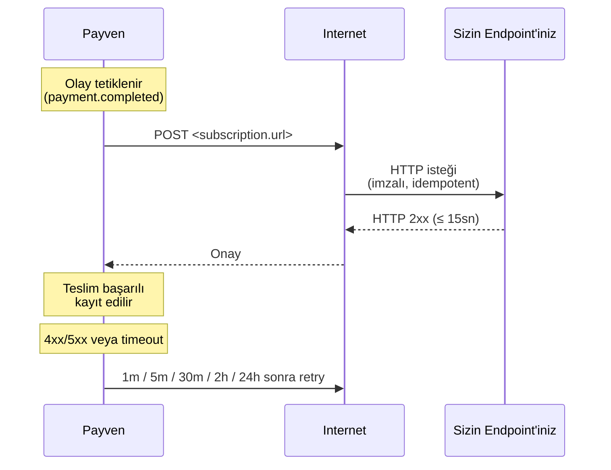

Webhook'lar; ödeme, iade, void, capture ve 3D Secure gibi olayları **sunucunuza HTTP POST** ile gönderir. Polling yerine event-driven çalışmanın yoludur — UI'da müşteri tarayıcısı kapansa bile sonuçları kaybetmezsiniz.

## Akış



## Endpoint kuralları

<Check>**HTTPS zorunlu** — HTTP URL'leri reddedilir.</Check>
<Check>**Public erişilebilir** — özel ağ veya VPN arkasında olamaz.</Check>
<Check>**15 saniye içinde HTTP 2xx döner** — uzun süren işler için iş kuyruğa atılmalıdır.</Check>
<Check>**Idempotent çalışır** — aynı `X-Payven-Event-Id` ile aynı olay birden fazla kez gelebilir; duplicate'leri tek seferde işleyin.</Check>
<Check>**İmzayı doğrular** — sahte istekleri reddeder (bkz. [İmza Doğrulama](/sanal-pos/webhooks/signature)).</Check>

## İstek formatı

```http
POST /webhooks/payven HTTP/1.1
Host: example.com
Content-Type: application/json
X-Payven-Event:        payment.completed
X-Payven-Event-Id:     evt_8e3f5c129a7b4c8dbc4e
X-Payven-Delivery-Id:  9f1c8e76-2a3b-4f12-9c8d-12cb24a8a8a8
X-Payven-Signature:    sha256=4f1d8c92ab7e3bcf9...
X-Payven-Timestamp:    1714742400
```

```json
{
  "id":         "evt_8e3f5c129a7b4c8dbc4e",
  "type":       "payment.completed",
  "created_at": "2026-05-03T12:34:58.123+00:00",
  "data": {
    "transaction_id":          "8e3f5c12-9a7b-4c8d-bc4e-2c963f66afa6",
    "status":                  "completed",
    "amount":                  15000,
    "currency":                "TRY",
    "merchant_id":             "3fa85f64-5717-4562-b3fc-2c963f66afa6",
    "provider_transaction_id": "9f3d2b8e-...",
    "auth_code":               "123456",
    "error_code":              null,
    "error_message":           null,
    "masked_card_number":      "454671******7894",
    "card_brand":              "visa"
  }
}
```

| Header | Açıklama |
|---|---|
| `X-Payven-Event` | Olay tipi (örn. `payment.completed`) — bkz. [Olay Tipleri](/sanal-pos/webhooks/events) |
| `X-Payven-Event-Id` | Olay kimliği — aynı olay birden fazla kez gönderilebilir, idempotency için bu alanı kullanın |
| `X-Payven-Delivery-Id` | Bu spesifik teslim denemesinin kimliği — debug için |
| `X-Payven-Signature` | `sha256=<hex>` formatında HMAC-SHA256 imza |
| `X-Payven-Timestamp` | İmzalanan Unix zaman damgası (saniye) — replay koruması için 5 dakika tolerance |

## Abone olma

```bash
curl -X POST https://vpos.payven.com.tr/api/v1/webhooks \
  -H "Authorization: Bearer $PAYVEN_TOKEN" \
  -H "Content-Type: application/json" \
  -d '{
    "url":    "https://example.com/webhooks/payven",
    "events": ["payment.completed", "payment.failed", "refund.completed"]
  }'
```

Yanıt:

```json
{
  "id":              "8e3f5c12-9a7b-4c8d-bc4e-2c963f66afa6",
  "url":             "https://example.com/webhooks/payven",
  "events":          ["payment.completed", "payment.failed", "refund.completed"],
  "secret":          "whsec_AbC123dEf456GhI789jKl012MnO345pQ",
  "max_retry_count": 5,
  "is_active":       true,
  "created_at":      "2026-05-03T12:34:56.789+00:00"
}
```

<Warning>
**`secret` değerini saklayın** — yalnızca bu yanıtta bir kez gösterilir. İmza
doğrulamasında bu değeri kullanacaksınız. Kaybedilirse `POST /webhooks/{id}/rotate-secret`
ile yenileyebilirsiniz.
</Warning>

## En az bir kez teslim (at-least-once)

Payven webhook teslimi **at-least-once** garantilidir — aynı olay birden fazla kez gelebilir. Sebepler:
- Sizin endpoint'iniz timeout / 5xx döndü → retry tetiklendi
- Network kesintisi → response kaybı → retry tetiklendi
- Konsoldan manuel replay yapıldı

Bu nedenle handler'larınızı **idempotent** yazın:

```javascript
async function handleWebhook(req, res) {
  const eventId = req.headers["x-payven-event-id"];

  // Veritabanında bu eventId daha önce işlendi mi?
  if (await db.processedEvents.exists(eventId)) {
    return res.status(200).end();   // ack but skip
  }

  // İşle
  const event = req.body;
  await processEvent(event);

  // Idempotent kayıt
  await db.processedEvents.insert({ id: eventId, processedAt: new Date() });
  res.status(200).end();
}
```

## Konsoldan teslim logları

Konsol → **Webhook Teslim Logları** ekranından her teslim denemesinin:

- HTTP yanıt kodu
- Yanıt gövdesi
- Süresi (ms)
- Yeniden deneme sayısı (mevcut + maks)
- Tam request + response payload'u
- Hata mesajı

görüntülenebilir. Manuel replay butonu ile bir olayı yeniden gönderebilirsiniz.

## Lokal geliştirme

Production endpoint'iniz hazır olmadan test etmek için:

| Araç | Komut | Not |
|---|---|---|
| ngrok | `ngrok http 3000` | Localhost'u dakikalar içinde public URL'e bağlar |
| Cloudflare Tunnel | `cloudflared tunnel run <name>` | Daha kalıcı, kendi domain'inize bağlanabilir |
| webhook.site | UI üzerinden | Test webhook gövdelerini görmek için ideal |

Sandbox webhook'ları gerçek imzayla gelir — imza doğrulamayı sandbox'a da kurun.

## Sonraki adımlar

<CardGroup cols={2}>
  <Card title="İmza Doğrulama" icon="shield-check" href="/sanal-pos/webhooks/signature">
    HMAC-SHA256 verifikasyon kodu — 5 dilde örnek.
  </Card>
  <Card title="Olay Tipleri" icon="list" href="/sanal-pos/webhooks/events">
    Tüm 8 olay tipi ve payload alanları.
  </Card>
  <Card title="Retry Politikası" icon="arrows-rotate" href="/sanal-pos/webhooks/retry-policy">
    5 deneme, 1m → 24h backoff + ±20% jitter.
  </Card>
  <Card title="Hata Yönetimi" icon="triangle-exclamation" href="/documentation/concepts/errors">
    Webhook handler'da retry, fallback ve idempotency stratejileri.
  </Card>
</CardGroup>
