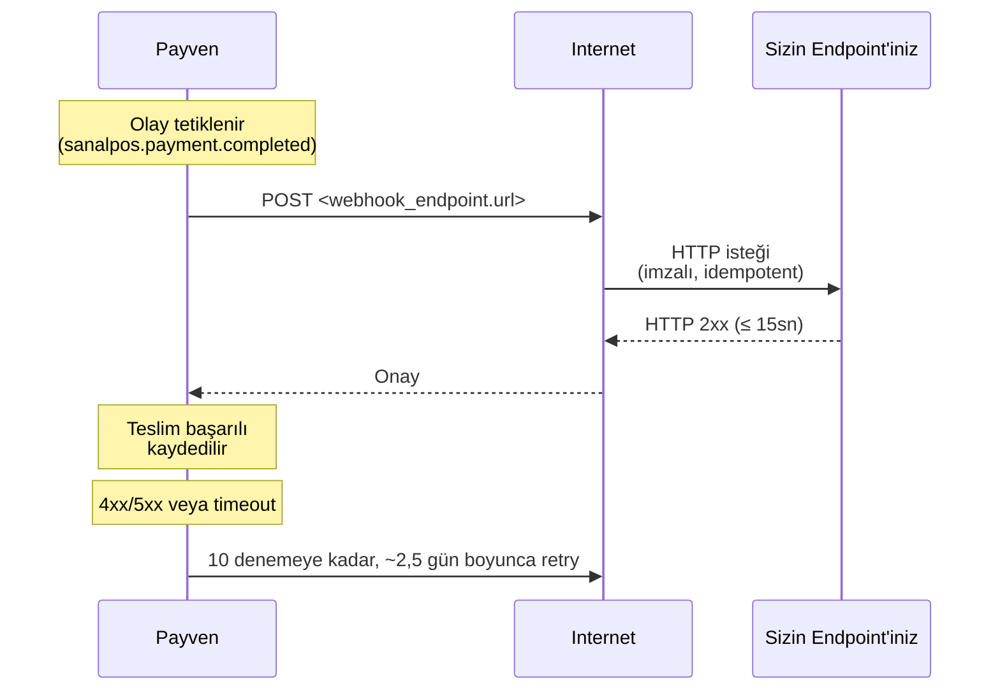

Webhook'lar; ödeme, iade, void, capture ve 3D Secure gibi olayları **sunucunuza HTTP POST** ile gönderir. Polling yerine event-driven çalışmanın yoludur — UI'da müşteri tarayıcısı kapansa bile sonuçları kaybetmezsiniz.

Sanal POS olayları Payven'in **tek webhook ucuna** gelir: uçlar Sanal POS API'sinde değil
**İşyeri API'sinde** (`/api/v1/webhook-endpoints`) yönetilir ve aynı uç diğer ürünlerin
olaylarını da alabilir. Genel kurallar: [Webhook'lar](/documentation/concepts/webhooks).

## Akış


```mermaid
sequenceDiagram
    participant Payven
    participant Net as Internet
    participant You as Sizin Endpoint'iniz

    Note over Payven: Olay tetiklenir<br/>(sanalpos.payment.completed)
    Payven->>Net: POST <webhook_endpoint.url>
    Net->>You: HTTP isteği<br/>(imzalı, idempotent)
    You-->>Net: HTTP 2xx (≤ 15sn)
    Net-->>Payven: Onay
    Note over Payven: Teslim başarılı<br/>kaydedilir

    Note over Payven: 4xx/5xx veya timeout
    Payven->>Net: 10 denemeye kadar, ~2,5 gün boyunca retry
```

## Endpoint kuralları

<Check>**HTTPS zorunlu** — HTTP URL'leri reddedilir.</Check>
<Check>**Public erişilebilir** — özel ağ veya VPN arkasında olamaz.</Check>
<Check>**15 saniye içinde HTTP 2xx döner** — uzun süren işler için iş kuyruğa atılmalıdır.</Check>
<Check>**Idempotent çalışır** — aynı `X-Payven-Event-Id` ile aynı olay birden fazla kez gelebilir; duplicate'leri tek seferde işleyin.</Check>
<Check>**İmzayı doğrular** — sahte istekleri reddeder (bkz. [İmza Doğrulama](/sanal-pos/webhooks/signature)).</Check>

## İstek formatı

```http
POST /webhooks/payven HTTP/1.1
Host: example.com
Content-Type: application/json
X-Payven-Event:        sanalpos.payment.completed
X-Payven-Event-Id:     evt_8e3f5c129a7b4c8dbc4e2c963f66afa6
X-Payven-Delivery-Id:  9f1c8e76-2a3b-4f12-9c8d-12cb24a8a8a8
X-Payven-Signature:    sha256=4f1d8c92ab7e3bcf9...
X-Payven-Timestamp:    1714742400
```

Gövde varsayılan olarak **olay zarfıdır** (`payload_format: event`); Sanal POS'un olay gövdesi
`data.object` altındadır:

```json
{
  "id":          "evt_8e3f5c129a7b4c8dbc4e2c963f66afa6",
  "object":      "event",
  "type":        "sanalpos.payment.completed",
  "created":     "2026-05-03T15:34:58.123+03:00",
  "livemode":    true,
  "api_version": "2026-09-24",
  "resource_id": "8e3f5c12-9a7b-4c8d-bc4e-2c963f66afa6",
  "data": {
    "object": {
      "event_type":              "sanalpos.payment.completed",
      "webhook_event_id":        "9f1c8e76-2a3b-4f12-9c8d-12cb24a8a8a8",
      "transaction_id":          "8e3f5c12-9a7b-4c8d-bc4e-2c963f66afa6",
      "tenant_id":               "11111111-1111-1111-1111-111111111111",
      "status":                  "completed",
      "operation_type":          "sale",
      "amount":                  15000,
      "currency":                "TRY",
      "merchant_id":             "MRCH-001",
      "external_id":             "ORDER-1001",
      "basket_id":               "BASKET-2026-001",
      "provider_transaction_id": "9f3d2b8e-...",
      "auth_code":               "123456",
      "host_reference":          "PAYVEN-REF-789",
      "error_code":              null,
      "error_message":           null,
      "masked_card_number":      "454671******7894",
      "card_brand":              "bonus",
      "connector_config_id":     "5b2e7c10-...",
      "bank_code":               "akbank",
      "payment_method_category": "card",
      "installment_count":       1,
      "occurred_at":             "2026-05-03T15:34:58.123+03:00",
      "metadata":                { "checkout_session_id": "..." }
    }
  }
}
```

Uç `payload_format: flat` ile açıldıysa gövde **yalnız `data.object`** içeriğidir (zarfsız; hazır
e-ticaret eklentileri bu biçimi kullanır). Başlıklar iki biçimde de aynıdır.

| Header | Açıklama |
|---|---|
| `X-Payven-Event` | Olay tipi (örn. `sanalpos.payment.completed`) — bkz. [Olay Tipleri](/sanal-pos/webhooks/events) |
| `X-Payven-Event-Id` | Olay kimliği (`evt_...`, zarftaki `id`) — aynı olay birden fazla kez gönderilebilir, idempotency için bu alanı kullanın |
| `X-Payven-Delivery-Id` | Teslim kimliği — debug ve destek için |
| `X-Payven-Signature` | `sha256=<hex>` formatında HMAC-SHA256 imza; sır yenileme geçişinde virgülle iki imza |
| `X-Payven-Timestamp` | İmzalanan Unix zaman damgası (saniye) — replay koruması için 5 dakika tolerans |

## Abone olma

```bash
curl -X POST https://merchant.payven.com.tr/api/v1/webhook-endpoints \
  -H "Authorization: Bearer $PAYVEN_TOKEN" \
  -H "Content-Type: application/json" \
  -d '{
    "url":            "https://example.com/webhooks/payven",
    "enabled_events": ["sanalpos.payment.completed", "sanalpos.payment.failed", "sanalpos.refund.completed"]
  }'
```

API anahtarınızın **İşyeri API'si (`merchant`)** kapsamı seçili olmalıdır. Yanıt (`201`):

```json
{
  "id":             "8e3f5c12-9a7b-4c8d-bc4e-2c963f66afa6",
  "object":         "webhook_endpoint",
  "url":            "https://example.com/webhooks/payven",
  "enabled_events": ["sanalpos.payment.completed", "sanalpos.payment.failed", "sanalpos.refund.completed"],
  "payload_format": "event",
  "status":         "enabled",
  "metadata":       {},
  "created":        "2026-05-03T12:34:56.789+03:00",
  "secret":         "whsec_3f9a..."
}
```

<Warning>
**`secret` değerini saklayın** — yalnızca bu yanıtta bir kez gösterilir. İmza
doğrulamasında bu değeri kullanacaksınız. Kaybedilirse `POST /webhook-endpoints/{id}/rotate-secret`
ile yenileyebilirsiniz.
</Warning>

## En az bir kez teslim (at-least-once)

Payven webhook teslimi **at-least-once** garantilidir — aynı olay birden fazla kez gelebilir. Sebepler:
- Sizin endpoint'iniz timeout / 5xx döndü → retry tetiklendi
- Network kesintisi → response kaybı → retry tetiklendi
- Teslim panelden ya da `POST /webhook-endpoints/deliveries/{id}/retry` ile yeniden gönderildi

Bu nedenle handler'larınızı **idempotent** yazın:

```javascript
async function handleWebhook(req, res) {
  const eventId = req.headers["x-payven-event-id"];

  // Veritabanında bu eventId daha önce işlendi mi?
  if (await db.processedEvents.exists(eventId)) {
    return res.status(200).end();   // ack but skip
  }

  // İşle
  const event = req.body;
  await processEvent(event);

  // Idempotent kayıt
  await db.processedEvents.insert({ id: eventId, processedAt: new Date() });
  res.status(200).end();
}
```

## Teslim kayıtları

Her teslim ve denemesi İşyeri API'sinden okunur (panelde **Geliştirici › Webhook'lar**):

- `GET /webhook-endpoints/{id}/deliveries` — teslimler (`state`: `pending` / `succeeded` / `failed`, son HTTP kodu, sonraki deneme zamanı)
- `GET /webhook-endpoints/deliveries/{delivery_id}/attempts` — her denemenin HTTP kodu, süresi ve yanıt gövdesi
- `POST /webhook-endpoints/deliveries/{delivery_id}/retry` — teslimi hemen yeniden gönder
- `GET /events` — saklanan olaylar; webhook kaçırıldıysa buradan çekin

## Lokal geliştirme

Production endpoint'iniz hazır olmadan test etmek için:

| Araç | Komut | Not |
|---|---|---|
| ngrok | `ngrok http 3000` | Localhost'u dakikalar içinde public URL'e bağlar |
| Cloudflare Tunnel | `cloudflared tunnel run <name>` | Daha kalıcı, kendi domain'inize bağlanabilir |
| webhook.site | UI üzerinden | Test webhook gövdelerini görmek için ideal |

Sandbox webhook'ları gerçek imzayla gelir — imza doğrulamayı sandbox'a da kurun.

## Sonraki adımlar

<CardGroup cols={2}>
  <Card title="İmza Doğrulama" icon="shield-check" href="/sanal-pos/webhooks/signature">
    HMAC-SHA256 verifikasyon kodu — 5 dilde örnek.
  </Card>
  <Card title="Olay Tipleri" icon="list" href="/sanal-pos/webhooks/events">
    Sanal POS olay tipleri ve payload alanları.
  </Card>
  <Card title="Retry Politikası" icon="arrows-rotate" href="/sanal-pos/webhooks/retry-policy">
    10 deneme, ~2,5 gün, ±%20 jitter; 3 gün başarısızlıkta uç kapanır.
  </Card>
  <Card title="Hata Yönetimi" icon="triangle-exclamation" href="/documentation/concepts/errors">
    Webhook handler'da retry, fallback ve idempotency stratejileri.
  </Card>
</CardGroup>
